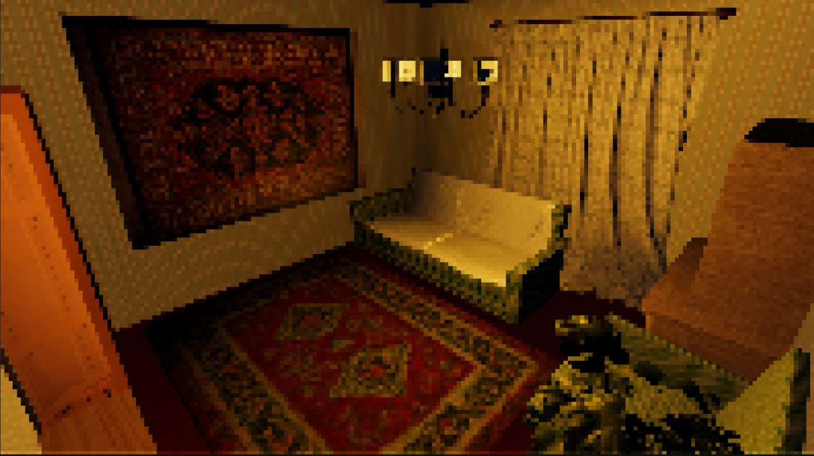
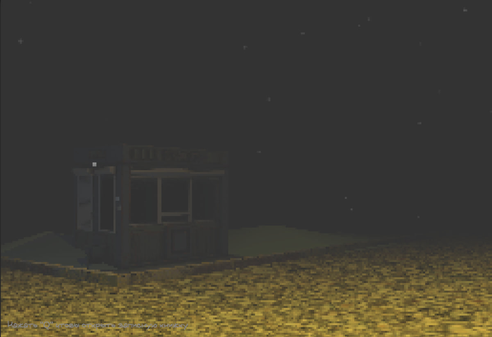
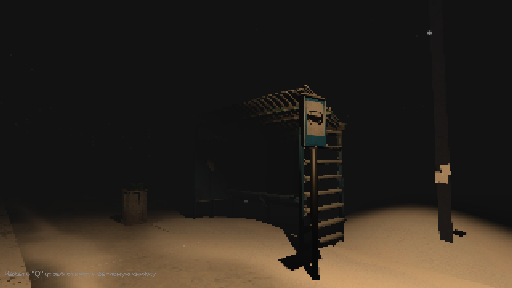
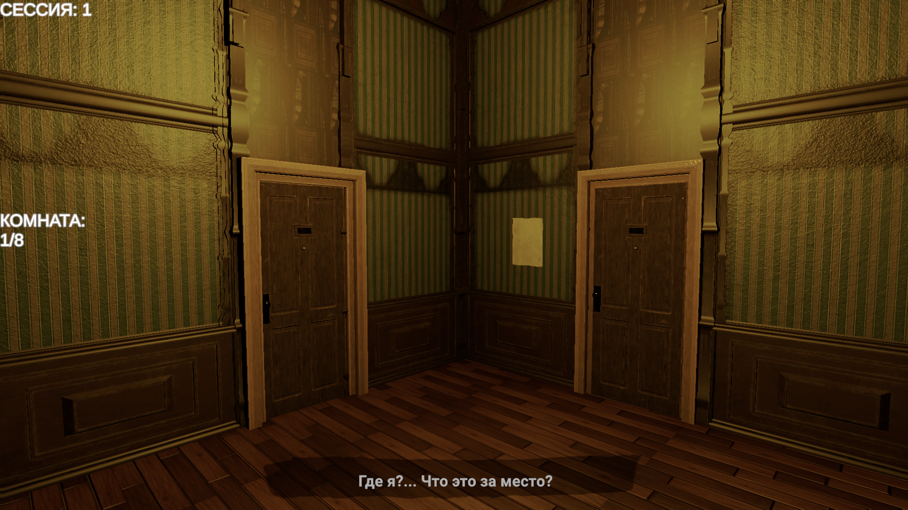
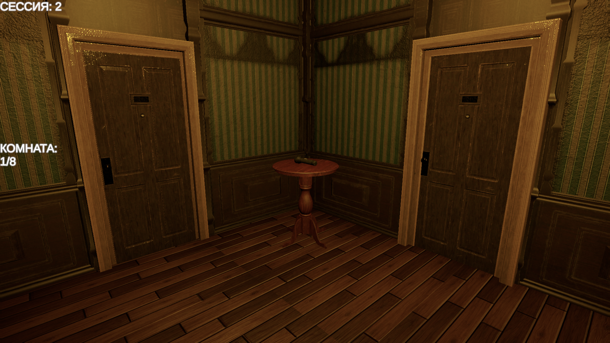
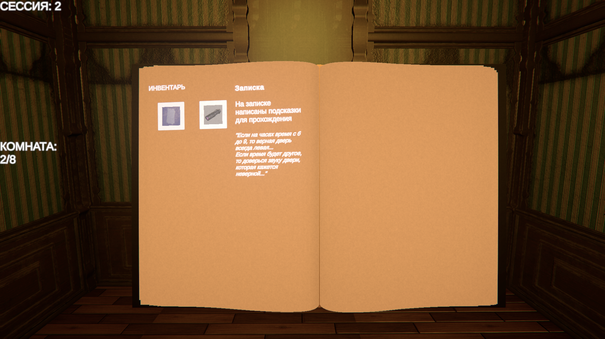
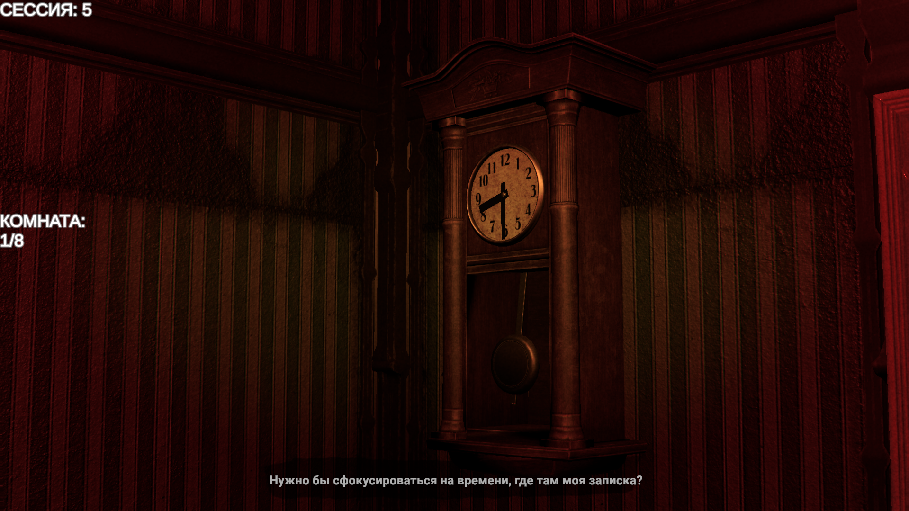

# Unity Developer Portfolio

## О себе

Unity разработчик (C#), занимаюсь около года.
Начал изучать Unity в январе 2025 с нуля. Сначала делал простые вещи — взаимодействие через триггеры, базовые скрипты, небольшие механики.
В марте начал делать свой первый проект и довёл его до конца (ZAVOD). После этого продолжил учиться: делал небольшие браузерные игры(яндекс игры), разбирался с SDK и в целом прокачивал навыки.
С сентября 2025 года работаю над своим текущим проектом — процедурный хоррор(названия ещё нет), где уже больше внимания уделяю архитектуре и системам.

Работаю с:
* Unity (C#)
* логикой и gameplay системами
* взаимодействием (raycast, триггеры)
* состояниями игры
* связями между системами

---

# Проекты

## ZAVOD

Тип: завершённый проект
Жанр: хоррор
Роль: solo разработчик

Это мой первый законченный проект.
Игрок просто исследует пространство и взаимодействует с окружением. Основной упор был на атмосферу и базовую логику.
Что сделал:

* контроллер игрока (движение + камера)
* взаимодействие через raycast (нажатие E)
* простые события и триггеры
* базовая логика уровня

Также:
* собирал сцены
* работал с ассетами
* настраивал свет и атмосферу

Чему научился:
* доводить проект до конца
* делать рабочую игровую логику

Ссылка на игру:
https://gamejolt.com/games/zavod/994742

---

## Procedural Horror (в разработке)

Тип: в разработке
Жанр: procedural horror
Роль: solo разработчик

---

## Идея

Долго думал над идей игры и вот:

Игрок должен анализировать аномалии в комнате и выбирать правильную дверь из трех.
Проект использует процедурный подход:
- в каждой попытке меняются аномалии
- меняется правильная дверь
- игрок не может запомнить решение, нужно каждый раз анализировать заново

---

## Архитектура

Основу проекта сделал вокруг одной системы — Room.(Не думал что раздую так один класс, в будущем хочу разделить)

Она управляет:
* запуском всех систем
* спавном объектов
* применением аномалий
* логикой дверей

Есть отдельные менеджеры:

* AnomalyManager — выбирает аномалии
* SessionManager — отвечает за прогрессию
* RoomManager — хранит текущую комнату

---

## Основные системы

### AnomalyManager

Аномалии применяются динамически к комнате.

Каждая аномалия меняет поведение окружения:

* визуально
* через звук
* через логику

Если что-то ломается — есть fallback (например звуковые подсказки).

---

### Door

Логика выбора двери зависит от текущего состояния комнаты.

Например:

* в аномалии с часами правильная дверь зависит от времени

---

### Puzzle Systems

Сделал несколько механик:

* часы
* записки
* UV фонарик

Они дают игроку информацию, которую нужно интерпретировать.

---

### PlayerController

Реализовал контроллер игрока:

* движение
* камера
* взаимодействие
* простые эффекты типа раскачивание головы(headbob)

---

### VoiceGuide

Система подсказок:

* сообщения идут в очередь
* есть приоритет
* текст появляется с эффектом печати
* есть звук

Используется для объяснения(делаю как внутренний голос игрока)

---

### SessionManager

Отвечает за:

* переход между попытками
* сброс состояния
* взаимодействие с другими системами

---

### Sanity System

Система ухудшения состояния игрока за ошибки(неправильно выбранную дверь).

При ошибках:
* усиливаются визуальные эффекты

Использовал:
* vignette
* chromatic aberration
* grain

---

## Технические моменты

* централизованное управление через Room
* важен порядок инициализации (сначала системы, потом логика)
* многие вещи завязаны на состоянии объектов (например часы)
* для зеркала использовал RenderTexture
* сделал очередь сообщений для UI
* сделал 3d инвентарь

---

Сделал один префаб комнаты и в нём рандомлю аномалию и какая будет верная дверь.

---

## Моя роль

Проект делаю полностью сам.

Занимаюсь:

* архитектурой
* логикой
* интеграцией систем
* сценами и атмосферой

---

## Код

Скрипты:
[https://github.com/KrltiKZ/unity-portfolio/Assets/procedure_scripts](https://github.com/KrItiKZ/unity-portfolio/tree/main/Assets/procedure_scripts)

---

## Видео

https://youtu.be/9L2Nz-I3bro

---

## Сейчас

Проект в разработке.

Сейчас работаю над:

* системой анализа аномалий через интерфейс(одна из будущих главных механик)
* улучшением архитектуры
* уменьшением связности
* новыми аномалиями
